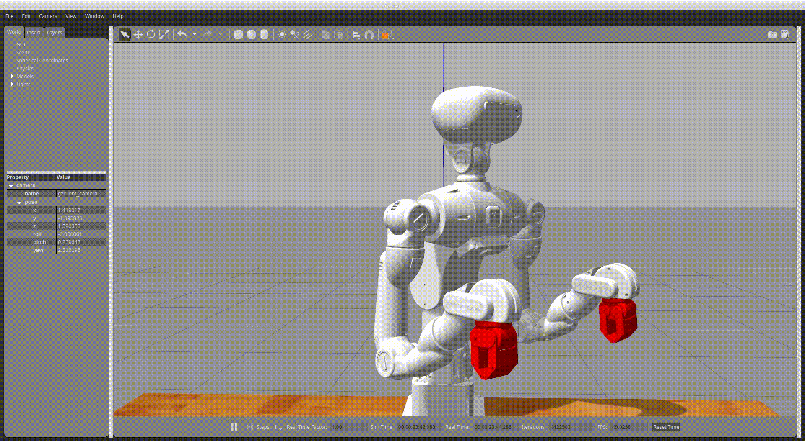

# all-images

- [crane-x7-cad](#crane-x7-cad)
- [crane-x7](#crane-x7)
- [jetson-nano-mouse](#jetson-nano-mouse)
- [jetson-nano](#jetson-nano)
- [raspberry-pi-mouse](#raspberry-pi-mouse)
- [sciurus17](#sciurus17)
- [usb-9axisimu](#usb-9axisimu)

## crane-x7-cad

- [CRANE-X7-v1.2.stp.png](crane-x7-cad/CRANE-X7-v1.2.stp.png)

- [CRANE-X7_HandA_RealSenseD435mount.stp.png](crane-x7-cad/CRANE-X7_HandA_RealSenseD435mount.stp.png)

- [CRANE-X7v20180626.stp.png](crane-x7-cad/CRANE-X7v20180626.stp.png)

[back to top](#all-images)

---

## crane-x7

- [bringup.jpg](crane-x7/bringup.jpg)

- [bringup_rviz.gif](crane-x7/bringup_rviz.gif)

- [crane_x7_gazebo.png](crane-x7/crane_x7_gazebo.png)

- [gazebo_gripper_example.gif](crane-x7/gazebo_gripper_example.gif)

- [gazebo_joint_values_example.gif](crane-x7/gazebo_joint_values_example.gif)

- [gazebo_obstacle_avoidance.gif](crane-x7/gazebo_obstacle_avoidance.gif)

- [gazebo_pick_and_place.gif](crane-x7/gazebo_pick_and_place.gif)

- [gazebo_pick_and_place.png](crane-x7/gazebo_pick_and_place.png)

- [gazebo_pose_groupstate.gif](crane-x7/gazebo_pose_groupstate.gif)

- [joystick_example_key_config.png](crane-x7/joystick_example_key_config.png)

- [joystick_example_key_numbers.png](crane-x7/joystick_example_key_numbers.png)

- [obstacle_avoidance_1.png](crane-x7/obstacle_avoidance_1.png)

- [obstacle_avoidance_2.png](crane-x7/obstacle_avoidance_2.png)

- [readme_rqt_reconfigure.png](crane-x7/readme_rqt_reconfigure.png)

[back to top](#all-images)

---

## jetson-nano-mouse

- [Jetson-Nano-Mouse-500x500.png](jetson-nano-mouse/Jetson-Nano-Mouse-500x500.png)

- [Jetson-Nano-Mouse.png](jetson-nano-mouse/Jetson-Nano-Mouse.png)

- [jnm_jupyternotebook_sample.png](jetson-nano-mouse/jnm_jupyternotebook_sample.png)

[back to top](#all-images)

---

## jetson-nano

- [camera_calibration.png](jetson-nano/camera_calibration.png)

- [csi_cam_rqt_image_view.png](jetson-nano/csi_cam_rqt_image_view.png)

- [jetson_nano_dual_csi.jpg](jetson-nano/jetson_nano_dual_csi.jpg)

[back to top](#all-images)

---

## raspberry-pi-mouse

- [field_calibration.JPG](raspberry-pi-mouse/field_calibration.JPG)

- [joystick_control_keyconfig.png](raspberry-pi-mouse/joystick_control_keyconfig.png)

- [line_calibration.JPG](raspberry-pi-mouse/line_calibration.JPG)

- [mouse_with_imu_1.JPG](raspberry-pi-mouse/mouse_with_imu_1.JPG)

- [mouse_with_imu_2.JPG](raspberry-pi-mouse/mouse_with_imu_2.JPG)

- [mouse_with_lds01.JPG](raspberry-pi-mouse/mouse_with_lds01.JPG)

- [mouse_with_line_trace_sensor.JPG](raspberry-pi-mouse/mouse_with_line_trace_sensor.JPG)

- [mouse_with_rpilidar.JPG](raspberry-pi-mouse/mouse_with_rpilidar.JPG)

- [mouse_with_rplidar.png](raspberry-pi-mouse/mouse_with_rplidar.png)

- [mouse_with_urg.JPG](raspberry-pi-mouse/mouse_with_urg.JPG)

- [object_tracking.JPG](raspberry-pi-mouse/object_tracking.JPG)

- [object_tracking_ros2.png](raspberry-pi-mouse/object_tracking_ros2.png)

- [raspberry_pi_mouse.JPG](raspberry-pi-mouse/raspberry_pi_mouse.JPG)

- [raspimouse_3dmodel.png](raspberry-pi-mouse/raspimouse_3dmodel.png)

- [slam_gmapping.png](raspberry-pi-mouse/slam_gmapping.png)

- [slam_toolbox_ros2.png](raspberry-pi-mouse/slam_toolbox_ros2.png)

- [start_trace.JPG](raspberry-pi-mouse/start_trace.JPG)

- [web_video_server.png](raspberry-pi-mouse/web_video_server.png)

[back to top](#all-images)

---

## sciurus17

- [ar_marker_setup.jpg](sciurus17/ar_marker_setup.jpg)

- [gazebo_box_stacking.gif](sciurus17/gazebo_box_stacking.gif)

- [gazebo_chest_camera.gif](sciurus17/gazebo_chest_camera.gif)

- [gazebo_gripper_example.gif](sciurus17/gazebo_gripper_example.gif)

- [gazebo_head_camera.gif](sciurus17/gazebo_head_camera.gif)

- [gazebo_neck_example.gif](sciurus17/gazebo_neck_example.gif)

- [gazebo_pick_and_place_left.gif](sciurus17/gazebo_pick_and_place_left.gif)

- [gazebo_pick_and_place_right.gif](sciurus17/gazebo_pick_and_place_right.gif)

- [gazebo_pick_and_place_two.gif](sciurus17/gazebo_pick_and_place_two.gif)

- [gazebo_waist_example.gif](sciurus17/gazebo_waist_example.gif)

- [readme_rqt_reconfigure.png](sciurus17/readme_rqt_reconfigure.png)

- [rviz_box_stacking.png](sciurus17/rviz_box_stacking.png)

- [sciurus17_gazebo.png](sciurus17/sciurus17_gazebo.png)

- [visual_feedback_with_ar_marker.jpg](sciurus17/visual_feedback_with_ar_marker.jpg)

[back to top](#all-images)

---

## usb-9axisimu

- [usb-9axisimu.png](usb-9axisimu/usb-9axisimu.png)

[back to top](#all-images)

---

